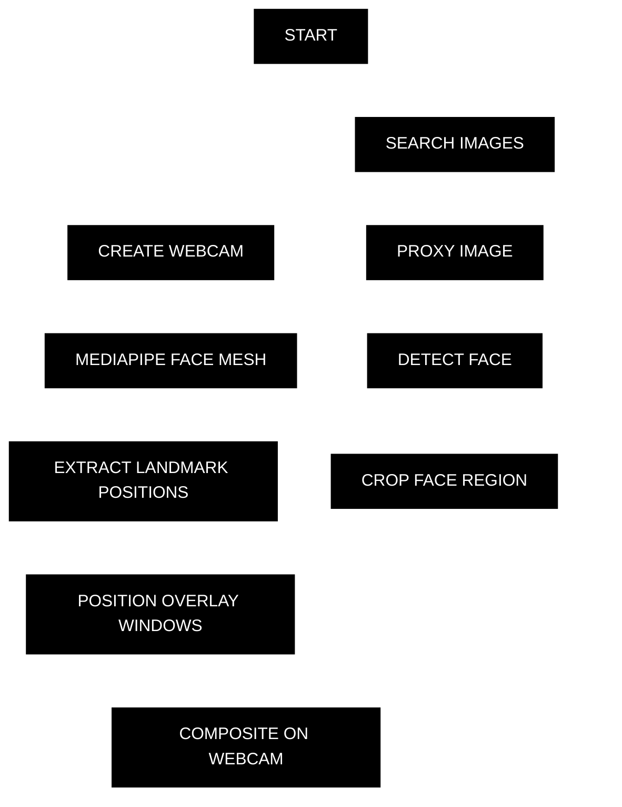

# assisted_self-portrait

<p align="right"><em>
<a href="https://vimeo.com/leandroestrella/assisted-portrait">video performance</a>, <a href="https://assistedselfportrait.leandroestrella.com/">ar filter</a>, 16:9, hd, sound, 1:30 minutes, 2014–2026
</em></p>

creating a self-portrait using images from the web, with the aid of an anonymous search engine composed in a screen-performance on my computer desktop.

## how it works?



bundled default images are shown instantly while the search + crop pipeline runs in the background. each detected face gets its own unique set of portrait images.

## tech stack

- **face tracking**: [mediapipe face mesh](https://developers.google.com/mediapipe/solutions/vision/face_landmarker) (468 landmarks, up to 5 faces)
- **image cropping**: [face-api.js](https://github.com/justadudewhohacks/face-api.js) (ssd mobilenet + 68-point landmarks)
- **image search**: duckduckgo image search (server-side proxy)
- **server**: express (local dev) / php + apache (production)
- **deploy**: github actions → ftp to cpanel on push to main

## setup

```bash
npm install
npm start
# open http://localhost:3000
```

requires camera access. works on desktop and mobile browsers.

## license

[apache 2.0](LICENSE)